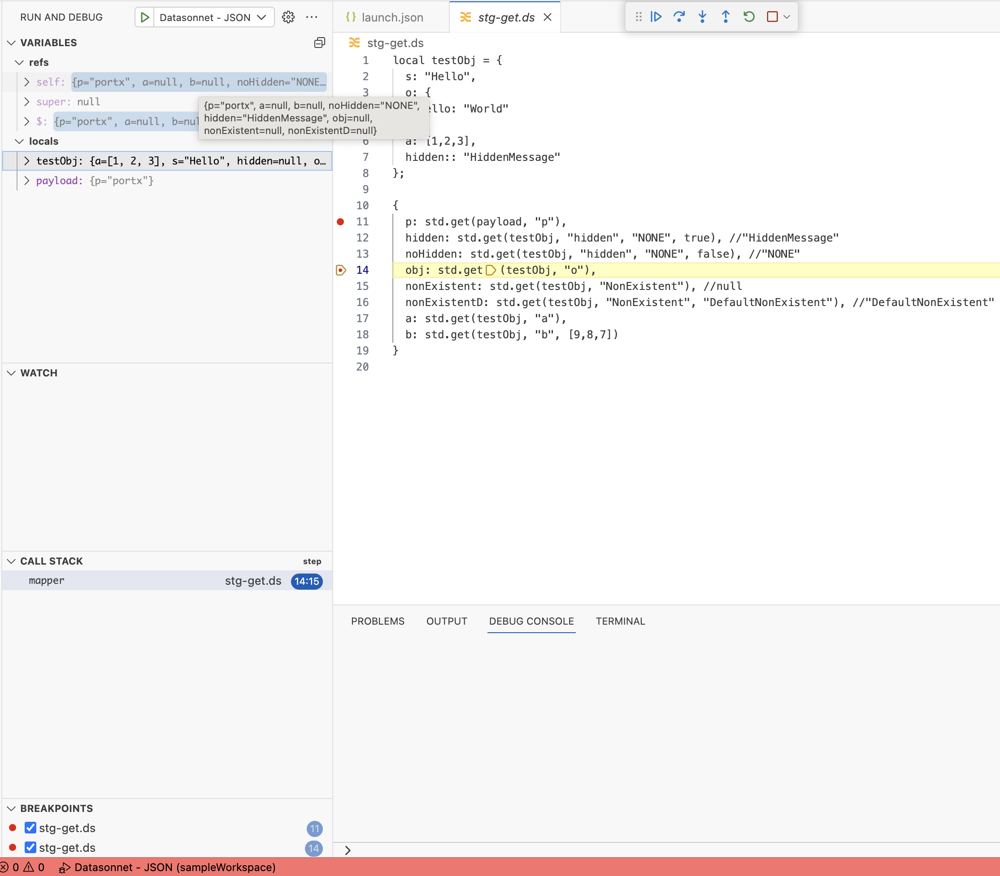
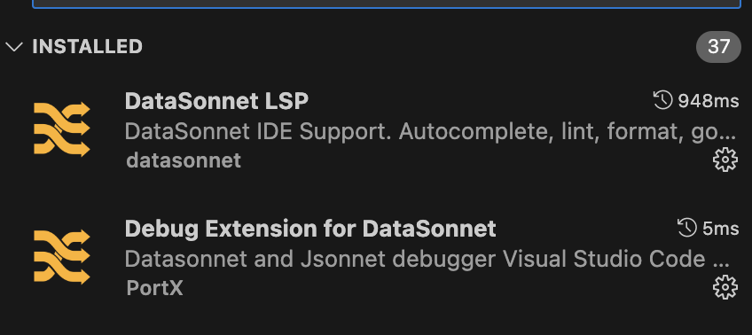

<h1 align="center">
 
 <br>
 Visual Studio Code debug adapter for Datasonnet and Jsonnet
</h1>


<p align="center">
 <a href="https://marketplace.visualstudio.com/items?itemName=portx.vscode-debug-adapter-datasonnet"></a>
 <a href="https://github.com/datasonnet/datasonnet-vscode-debugger/actions/workflows/main.yaml"></a>
 <a href="https://github.com/datasonnet/datasonnet-vscode-debugger/blob/main/LICENSE"></a>
</p><br/>

<h2 align="center">Visual Studio Code debug adapter for Datasonnet and Jsonnet</h2>

<p align="center">
  <a href="#features">Features</a> •
  <!-- <a href="#requirements">Requirements</a> • -->
  <!-- <a href="#how-to-debug">Example</a> • -->
  <!-- <a href="https://datasonnet.github.io/datasonnet-vscode-debugger/">Documentation</a> • -->
  <a href="#issues">Issues</a>  •
</p>

<p align="center">
This is a <a href="https://code.visualstudio.com/">Visual Studio Code</a> extension that adds support for debugging <a href="https://datasonnet.com">Datasonnet</a> and <a href="https://jsonnet.org/">Jsonnet</a> scripts.
</p><br/>

<p align="center"></p>

This implementation is based on the <a href="https://marketplace.visualstudio.com/items?itemName=redhat.vscode-debug-adapter-apache-camel">Camel VS Code Debugger</a>


### Debugging Datasonnet

This extension uses the <a href="https://datasonnet.github.io/datasonnet-mapper/datasonnet/latest/jar-lib.html">Datasonnet Mapper</a> to execute the scripts. You can debug and run Datasonnet and Jsonnet scripts. <a href="">Datasonnet</a> <a href="https://datasonnet.github.io/datasonnet-mapper/datasonnet/latest/dataformats.html">adds supports for different formats like XML, CSV and YAML</a>, provides <a href="https://datasonnet.github.io/datasonnet-mapper/datasonnet/latest/libraries-core.html">libraries supporting extra functionality</a> to what Jsonnet provides, and is used primary as a mapping tool. You can check more example in its <a href="https://datasonnet.github.io/datasonnet-mapper/datasonnet/latest/cookbook.html">cookbook</a>.

To debug a script, just open it on the editor and create a launch configuration. The minimal launch configuration is:

```jsonc
{
  "type": "datasonnet",
  "request": "launch",
  "name": "Datasonnet - JSON",
  "program": "${file}",
  "fileBasename": "${fileBasename}",
}
```

This will run the `program`. If you need to specify a payload, add:

```json
  "payload": "${workspaceFolder}/resources/payload.json",
```

The input content type is inferred from the file extension.

And if you need to specify an output type other than JSON, set the following type to the appropriate MIME type:

```json
  "outputType": "application/xml"
```

### Dependencies

To be able to set breakpoints, you need to install a Datasonner Language Exstension. While we have this extension in preview, you'll need to manually install the extension from a VSIX file. The file can be found [on this extension's repo](https://raw.githubusercontent.com/datasonnet/datasonnet-vscode-debugger/main/deps/datasonnet-vscode-debugger-0.1.0.vsix)

Once you have the file, you can go on VS Code to the `extensions` tab, next on the ellipsis menu above to `Install from VSIX` and then install the extension.

Once you have both extensions enabled, they'll look like this:


<p align="center"></p>


<!--
Once the extension is published we need to add the dependency automatically using:

	"extensionDependencies": [
		"datasonnet.datasonnet-lsp"
	],
-->


  
### Features


- Add/Remove breakpoints
- Inspect variable values on suspended breakpoints
- Stepping
- Output is printed on the Debug Console
- You can set input and output formats ( JSON, XML, CSV )

<!-- ### Requirements

- **Java Runtime Environment 17+** with `com.sun.tools.attach.VirtualMachine` (available in most JVMs such as Hotspot and OpenJDK). The `java.home` VS Code preferences can be used to use a different version of JDK than the default one installed on the machine.

- The Camel instance to debug must follow these requirements:
  - **Camel 3.16+**
  - Have `camel-debug` on the classpath
  - Have **JMX enabled**
- ⚠️ For some features, The [JBang](https://www.jbang.dev/) must be available on a system command-line. -->

<!-- ### How To Debug - example

1. Ensure `jbang` is available on system command-line
2. Open a Camel route which can be started with JBang
3. Call command Palette (`Ctrl + Shift + P`), and pick command `Run Camel Application with JBang and Debug` or click on codelens `Camel Debug with JBang` which appears on top of the file.
4. Wait until the route is started and debugger is connected
5. Put a breakpoint on the Camel route
6. Debug! 🔥

<p align="center"></p> -->

<!-- ### Documentation

Our full documentation is located in [GitHub pages](https://datasonnet.github.io/datasonnet-vscode-debugger/). Included are details about all of DAP Client for Visual Studio Code capabilities with examples and detailed information. -->

### Issues

Something is not working properly? In that case, feel free to [open issues, add feature requests, report bugs, etc.](https://github.com/datasonnet/datasonnet-vscode-debugger/issues)

<!-- ### Get Involved

If you'd like to help us get better, we appriciate it! Check out our [Contribution Guide](Contributing.md) on how to do that. -->

